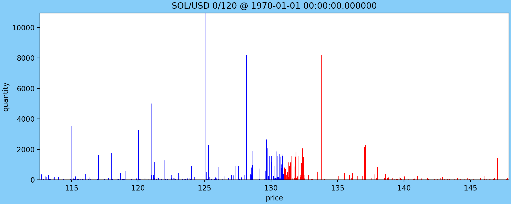

# Kraken Data Recorder



**Caveat emptor** *This project is under active development*

Kraken Data Recorder (*kdr*) is a tool for recording market data from
the Kraken crypto exchange (https://www.kraken.com/). It subscribes to
the *book* channel on the websocket v2 endpoint and stores the content
in a series of [parquet](https://parquet.apache.org/docs/file-format)
files which can later be used for analysis, simulation, etc. The
animation above, for example, was made from data captured by *kdr*,
1000 levels of the SOL/USD book.

*kdr* aims to capture the complete Kraken level book feed at full
depth for all symbols in a single process with a minimal
footprint. This includes performing the [CRC32
checksum](https://docs.kraken.com/websockets-v2/#calculate-book-checksum)
for each book update. 

See https://docs.kraken.com/websockets-v2/#introduction

## Running *kdr_record*

You can find prebuilt copies of *kdr_record* for Ubuntu in
[releases](https://github.com/torquey66/kraken-data-recorder/releases)
or build it yourself (see below).

### Options

*kdr_record* supports the following options:
```
bash-3.2$ ./kdr_record --help
Subscribe to Kraken and serialize book/trade data:
  --help                             display program options
  --ping_interval_secs arg (=30)     ping/pong delay
  --kraken_host arg (=ws.kraken.com) Kraken websocket host
  --kraken_port arg (=443)           Kraken websocket port
  --pair_filter arg (=[])            explicit list of pairs to subscribe to as 
                                     json string
  --parquet_dir arg (=/tmp)          directory in which to write parquet output
  --book_depth arg (=1000)           one of {10, 25, 100, 500, 1000}
  --capture_book arg (=1)            subscribe to and record level book
  --capture_trades arg (=1)          subscribe to and record trades
```

By default, it will capture all pairs at depth 1000 and create parquet
files in *parquet_dir*. Last I measured these could require on the
order of 1GB of storage per hour, so take care to set *parquet_dir* to
a location with ample space.

### Example
```
kdr_record --ping_interval_secs 5 --parquet_dir /tmp/example
```

will create a series of parquet files in */tmp/exampe*:

```
bash-3.2$ ls -l /tmp/example/
total 49584
-rw-r--r--  1 torquey  wheel      5896 Aug  8 08:09 1723122455735103.assets.pq
-rw-r--r--  1 torquey  wheel  23606521 Aug  8 08:09 1723122455735103.book.pq
-rw-r--r--  1 torquey  wheel     18816 Aug  8 08:09 1723122455735103.pairs.pq
-rw-r--r--  1 torquey  wheel   1024693 Aug  8 08:09 1723122455735103.trades.pq
```

Each file is prefixed by a UTC timestamp in milliseconds. This allows
you to wrap *kdr_record* execution in a restart script to produce a
series of time-segmented files that can be combined after the fact.

All files contain snapshot as well as update events. These can be
replayed in an *event sourced* or *change data capture* fashion to
reproduce state at any given time.

 - **assets** contains the asset portion of the [instruments](https://docs.kraken.com/websockets-v2/#instrument)  reference data channel
 - **pairs** contains the asset portion of the [instruments](https://docs.kraken.com/websockets-v2/#instrument)  reference data channel
 - **book** contains snapshots and updates for all subscribed symbols on the [book](https://docs.kraken.com/websockets-v2/#book) channel
 - **trades** contains snapshots and updates for all subscribed symbols on the [trades](https://docs.kraken.com/websockets-v2/#trade) channel

### Query examples

All queries below were made with the most excellent [duckdb](https://duckdb.org/) tool.

#### Assets

```/bin/bash
D select *  from read_parquet('/tmp/1725392418418599.assets.pq');
┌──────────────────┬────────────┬──────────────────┬──────────┬─────────────┬───────────┬───────────────────┬────────┐
│     recv_tm      │ borrowable │ collateral_value │    id    │ margin_rate │ precision │ precision_display │ status │
│      int64       │  boolean   │      double      │ varchar  │   double    │   int64   │       int64       │  int8  │
├──────────────────┼────────────┼──────────────────┼──────────┼─────────────┼───────────┼───────────────────┼────────┤
│ 1725392420846218 │ true       │              1.0 │ USD      │       0.025 │         4 │                 2 │      2 │
│ 1725392420846218 │ true       │              1.0 │ EUR      │        0.02 │         4 │                 2 │      2 │
│ 1725392420846218 │ true       │              1.0 │ GBP      │        0.02 │         4 │                 2 │      2 │
│ 1725392420846218 │ true       │              1.0 │ AUD      │        0.02 │         4 │                 2 │      2 │
│ 1725392420846218 │ true       │              1.0 │ CAD      │        0.02 │         4 │                 2 │      2 │
│         ·        │   ·        │               ·  │  ·       │      ·      │         · │                 · │      · │
│         ·        │   ·        │               ·  │  ·       │      ·      │         · │                 · │      · │
│         ·        │   ·        │               ·  │  ·       │      ·      │         · │                 · │      · │
│ 1725392420846218 │ false      │              0.0 │ USD.M    │             │         4 │                 4 │      2 │
│ 1725392420846218 │ false      │              0.0 │ EUR.M    │             │         4 │                 4 │      2 │
│ 1725392420846218 │ false      │              0.0 │ XBT.M    │             │        10 │                 8 │      2 │
│ 1725392420846218 │ false      │              0.0 │ USDT.M   │             │         8 │                 4 │      2 │
│ 1725392420846218 │ false      │              0.0 │ USDC.M   │             │         8 │                 4 │      2 │
├──────────────────┴────────────┴──────────────────┴──────────┴─────────────┴───────────┴───────────────────┴────────┤
│ 343 rows (40 shown)                                                                                      8 columns │
└────────────────────────────────────────────────────────────────────────────────────────────────────────────────────┘
```

#### pairs
```/bin/bash
D select *  from read_parquet('/tmp/1725392418418599.pairs.pq');
┌──────────────────┬─────────┬──────────┬────────────────┬───────────┬────────────────┬────────────┬─────────────────────┬──────────────────────┬─────────────────┬─────────────────┬───────────────┬─────────┬───────────────┬─────────┬────────┬────────────┐
│     recv_tm      │  base   │ cost_min │ cost_precision │ has_index │ margin_initial │ marginable │ position_limit_long │ position_limit_short │ price_increment │ price_precision │ qty_increment │ qty_min │ qty_precision │  quote  │ status │   symbol   │
│      int64       │ varchar │  double  │     int64      │  boolean  │     double     │  boolean   │        int64        │        int64         │     double      │      int64      │    double     │ double  │     int64     │ varchar │  int8  │  varchar   │
├──────────────────┼─────────┼──────────┼────────────────┼───────────┼────────────────┼────────────┼─────────────────────┼──────────────────────┼─────────────────┼─────────────────┼───────────────┼─────────┼───────────────┼─────────┼────────┼────────────┤
│ 1725392420846218 │ EUR     │      0.5 │              5 │ true      │                │ false      │                     │                      │           1e-05 │               5 │         1e-08 │     0.5 │             8 │ USD     │      4 │ EUR/USD    │
│ 1725392420846218 │ GBP     │      0.5 │              5 │ true      │                │ false      │                     │                      │           1e-05 │               5 │         1e-08 │     5.0 │             8 │ USD     │      4 │ GBP/USD    │
│ 1725392420846218 │ USD     │     50.0 │              3 │ true      │                │ false      │                     │                      │           0.001 │               3 │         1e-08 │     5.0 │             8 │ JPY     │      4 │ USD/JPY    │
│ 1725392420846218 │ USD     │      1.0 │              5 │ true      │                │ false      │                     │                      │           1e-05 │               5 │         1e-08 │     5.0 │             8 │ CAD     │      4 │ USD/CAD    │
│ 1725392420846218 │ USD     │      0.5 │              5 │ true      │                │ false      │                     │                      │           1e-05 │               5 │         1e-08 │     5.0 │             8 │ CHF     │      4 │ USD/CHF    │
│         ·        │ ·       │       ·  │              · │  ·        │             ·  │  ·         │                  ·  │                   ·  │              ·  │               · │           ·   │      ·  │             · │  ·      │      · │   ·        │
│         ·        │ ·       │       ·  │              · │  ·        │             ·  │  ·         │                  ·  │                   ·  │              ·  │               · │           ·   │      ·  │             · │  ·      │      · │   ·        │
│         ·        │ ·       │       ·  │              · │  ·        │             ·  │  ·         │                  ·  │                   ·  │              ·  │               · │           ·   │      ·  │             · │  ·      │      · │   ·        │
│ 1725392420846218 │ TURBO   │     0.45 │             10 │ false     │                │ false      │                     │                      │           1e-06 │               6 │         1e-08 │  2000.0 │             8 │ EUR     │      4 │ TURBO/EUR  │
│ 1725392420846218 │ PRIME   │      0.5 │              7 │ false     │                │ false      │                     │                      │           0.001 │               3 │         1e-05 │     0.5 │             5 │ USD     │      4 │ PRIME/USD  │
│ 1725392420846218 │ PRIME   │     0.45 │              7 │ false     │                │ false      │                     │                      │           0.001 │               3 │         1e-05 │     0.5 │             5 │ EUR     │      4 │ PRIME/EUR  │
│ 1725392420846218 │ CXT     │      0.5 │              9 │ false     │                │ false      │                     │                      │           1e-05 │               5 │         1e-05 │    40.0 │             5 │ USD     │      4 │ CXT/USD    │
│ 1725392420846218 │ CXT     │     0.45 │              9 │ false     │                │ false      │                     │                      │           1e-05 │               5 │         1e-05 │    40.0 │             5 │ EUR     │      4 │ CXT/EUR    │
├──────────────────┴─────────┴──────────┴────────────────┴───────────┴────────────────┴────────────┴─────────────────────┴──────────────────────┴─────────────────┴─────────────────┴───────────────┴─────────┴───────────────┴─────────┴────────┴────────────┤
│ 753 rows (40 shown)                                                                                                                                                                                                                              17 columns │
└─────────────────────────────────────────────────────────────────────────────────────────────────────────────────────────────────────────────────────────────────────────────────────────────────────────────────────────────────────────────────────────────┘
```

## Building

### Prerequisites:

This project is currently built and tested with the following
tooling. These are by no means hard requirements (see for example the
CI pipeline for this project).

 - Conan version 2.5.0
 - cmake version 3.30.1
 - clang version 15.0.0
 - Python 3.12.4
 - jinja2-cli v0.8.2
 - Jinja2 v3.1.4

### Conan profile
```
[settings]
arch=x86_64
build_type=RelWithDebInfo
compiler=apple-clang
compiler.cppstd=gnu23
compiler.libcxx=libc++
compiler.version=15
os=Macos
```

### Command line build
```
mkdir build
conan install . --profile=release --build=missing --output-folder=build -sbuild_type=RelWithDebInfo
cd build
cmake  -DCMAKE_BUILD_TYPE=RelWithDebInfo  ..
make -j
ctest
```

### clang-tidy

Static checking via `clang-tidy` is currently a work in progress.
- There is a `.clang-tidy` file for the project which currently
  disables a few problematic checks.
- Over time this should evolve into a more complete set of appropriate
  checks.
- `clang-tidy` is not currently part of the CI pipeline.
- To run manually:
  - `cd build`
  - `cmake` with the `-DCMAKE_EXPORT_COMPILE_COMMANDS=1` flag
  - `clang-tidy -header-filter=.* -p=compile_commands.json $(find ../src -name '*.cpp')`


## License
kraken-data-recorder © 2023 by John C. Finley is licensed under
Creative Commons Attribution-NoDerivatives 4.0 International. To view
a copy of this license, visit
https://creativecommons.org/licenses/by-nd/4.0/
